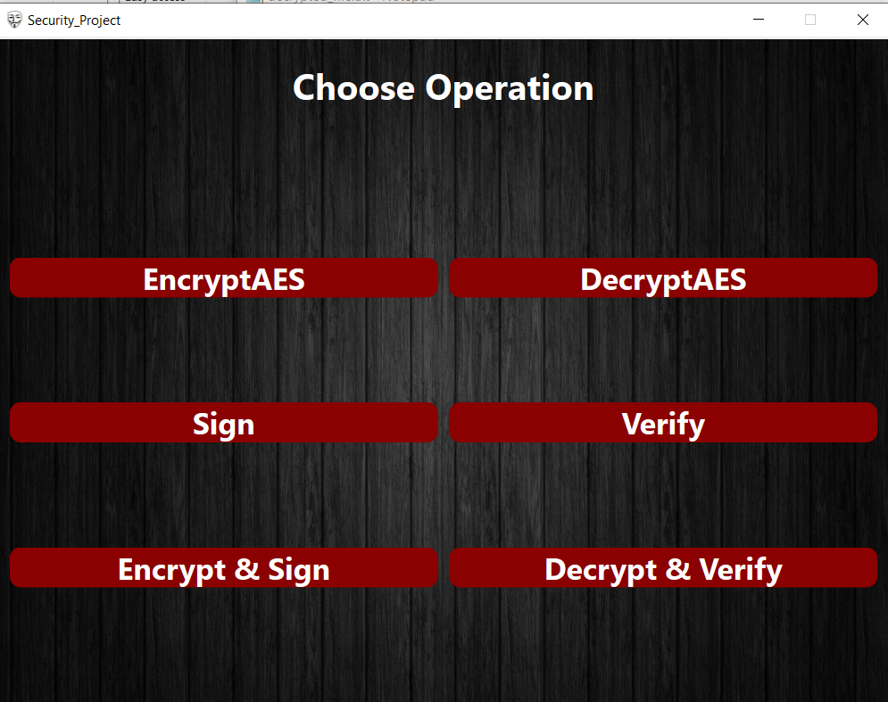
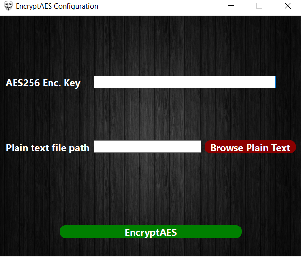
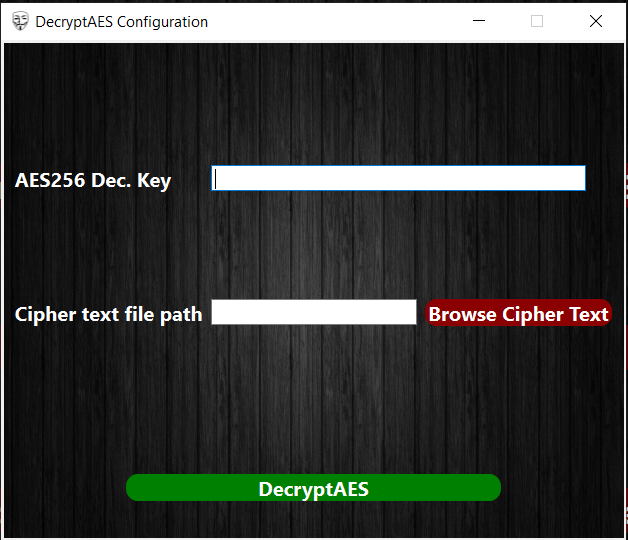

# **Cryptix Tool**


## **Table Of Contents**

- [Description](#description)
- [Installation](#installation)
- [Screenshots](#screenshots)
- [Usage](#usage)
- [Contributing](#contribution)
- [Contact](#contact)


## **Description**
Cryptix is a user-friendly Qt application that allows users to encrypt/decrypt/sign/verify files using the *AES* and *RSA* algorithms. Cryptix lets users generate RSA keys, as well as select the files they want to encrypt, decrypt, sign, or verify. Cryptix is designed to be fast, reliable, and secure, using the latest cryptographic standards and techniques. Cryptix is compatible with Windows, Linux, and Mac OS platforms.
The tool has the following six options:
- Encrypt             *using AES-256*
- Decrypt             *using AES-256*
- Sign                *using RSA-512*
- Verify              *using RSA-512*
- Encrypt + Sign      *using AES-256 + RSA-512*
- Priority-Preemptive *using AES-256 + RSA-512*


## **Installation**

To install and use the Cryptix, follow these step-by-step instructions:

1. Clone the repository
```jsx
git clone https://github.com/zeyadMohamed20/Security-Project.git
```

2. Run .exe file
```jsx

```

3. Congratulations the program is runnig ^_^


## **Screenshots**
<p align="center">
  <br>
  <br>
  <br>
</p>

## **Usage**

Here are step-by-step instructions for using the Cryptix tool:

- **Encryption using *AES-256***
    1. Press encrypt button.
    2. Choose the file you want to encrypt.
    3. You will be asked to enter the shared key.
    4. An encrypted file is generated called **"file.enc"**

- **Decryption using *AES-256***
`(You should encrypt a file first)`
    1. Press decrypt button.
    2. Choose the file you want to decrypt.
    3. You will be asked to enter the shared key.
    4. The original file is generated and called **"file2.txt"**

- **Signature using *RSA-512***
    1. Press sign button.
    2. Choose the file you want to sign.
    3. The public and private keys will be generated automatically *"public.pem", and *"private.pem"**.
    4. A file contains the signature is generated and called **"file.sig"** 

- **Verification using *RSA-512***
`(You should sign a file first)`
    1. Press verify button.
    2. Choose the file that contains the data.
    3. Choose the file that contains the signature *"file.sig"*.
    4. The the file is changed then the verification will fail, else it will succeed.

- **Encryption + Signature using *AES256 + RSA-512***
    1. Press encrypt + sign button.
    2. Choose the the file you want the encrypt and sign it.
    3. You will be asked to enter the shared key.
    4. The public and private keys will be generated automatically *"public.pem", and *"private.pem"**.
    5. Two files will be generated *"file.enc"* that contains the encryption using AES-256 and  *"file.sig"* that contains the signature using RSA-256

- **Decryption + Verification using *AES256 + RSA-512***
`(You should encrypt and sign a file first)`
    1. Press decrypt + verify button.
    2. Choose two files. the first is the encrypted file "*file.enc*", the second is the signature *"file.sig"*.
    3. You will be asked to enter the shared key.
    4. The decrypted file will be generated "*file2.txt*".
    5. If the file didn't changed, the verification will be done successfully else it will fail.

## **Contribution**
 
Thank you for considering contributing to this project! Please read the **[Contributor Covenant](https://www.contributor-covenant.org/)** before submitting any contributions.

### **Types of Contributions**

We welcome contributions in the form of bug reports, feature requests, code contributions, and documentation improvements.

### **How to Contribute**

1. Fork the repository and create a new branch.
2. Make your changes and ensure that they are well-documented and tested.
3. Submit a pull request to the main repository and include a detailed description of your changes.

### **Code of Conduct**

We expect all contributors to adhere to the **[Contributor Covenant](https://www.contributor-covenant.org/)**. Please be respectful and inclusive in your contributions and interactions with others.

## Contact

Feel free to reach out to us on any of the following emails:

- zeyadmohamedasu@gmail.com
- bishoyyosry@gmail.com